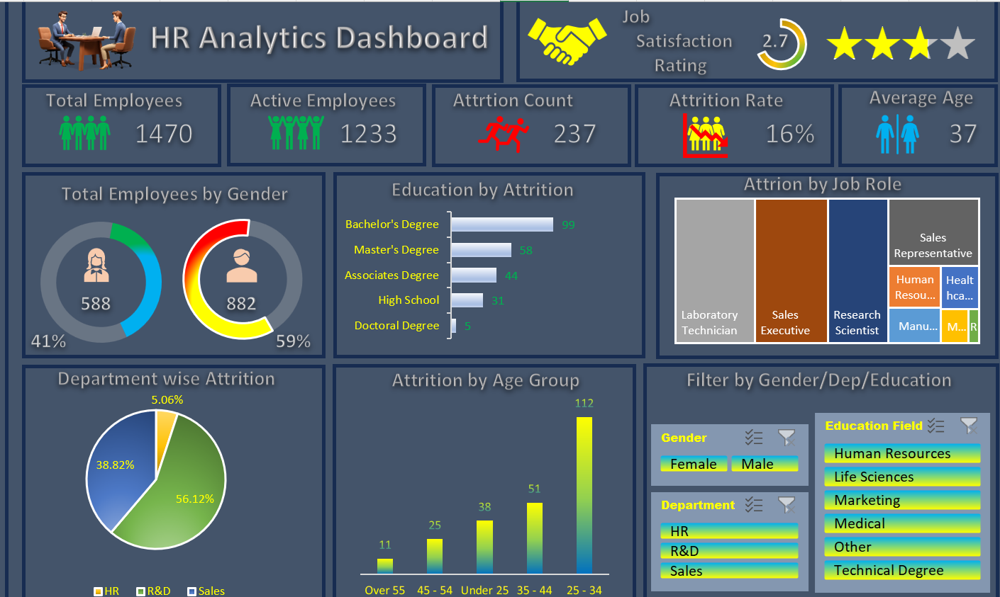

📝 README.md
# 👥 HR Analytics Dashboard (Excel)

An **interactive Excel dashboard** designed to analyze **employee data, attrition trends, and workforce demographics**.  
This tool helps HR teams and management monitor key metrics like **attrition rate, job satisfaction, and department-wise performance** to make informed talent management decisions.

---

## 📌 Overview
This dashboard consolidates HR data into **clear, visual insights**:
- **Attrition analysis** by education, age group, and job role
- **Workforce demographics** by gender and department
- **Job satisfaction ratings** across the organization
- **KPI tracking** for total employees, active employees, attrition rate, and average age

---

## 📊 Key Features
- **KPIs**: Total Employees, Active Employees, Attrition Count, Attrition Rate, Average Age
- **Attrition by Education** – See which education levels have higher attrition
- **Attrition by Job Role** – Identify roles with high turnover
- **Department-wise Attrition** – Monitor retention in HR, R&D, and Sales
- **Attrition by Age Group** – Understand employee retention across age ranges
- **Interactive Filters** – Filter by gender, department, and education

---

## 🛠 Tools & Technologies
- **Microsoft Excel** (Pivot Tables, Slicers, Conditional Formatting, Charts)
- **Data Cleaning** in Excel
- **Dynamic Visualizations** for HR data

---

## 🚀 How to Use
1. Download `HR_Analytics_Dashboard.xlsx` from this repository.
2. Open in **Microsoft Excel**.
3. Use slicers to filter data by:
   - Gender
   - Department
   - Education
4. Explore KPI cards and visual charts for insights.

---

## 📸 Dashboard Preview

---

## 📢 Author
Created by **[Girish Kumar V](https://github.com/GirishKumarV25)** – Passionate about **data analytics, visualizations**.
